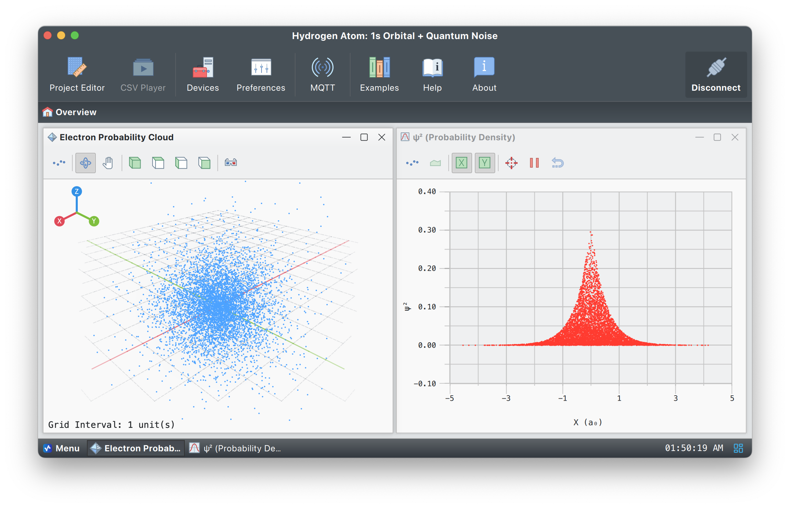

# **Hydrogen Atom: 1s Orbital**

## **Overview**

This project simulates the electron probability distribution of a hydrogen atom’s 1s orbital using Monte Carlo sampling. The data is streamed over UDP for real-time visualization in Serial Studio.

This is not a classical orbit model. Instead, it displays probabilistic electron positions derived from quantum mechanics, visualized as a dynamic 3D cloud.

**Note:** This project uses features available only under a paid license. Visit [serial-studio.com](https://serial-studio.com/) for more information.

## **Simulation Model**

The electron's radial distance from the nucleus, denoted by `r`, is sampled using the probability distribution for the 1s orbital:

$$
P(r) \propto r^2 \cdot e^{-2r / a_0}
$$

Where:  
- \( r \): Radial distance from the nucleus  
- \( a_0 \): Bohr radius (normalized to 1.0)

Electron positions are computed in spherical coordinates, then converted to Cartesian \( (x, y, z) \).

## **Project Features**

- Real-time 3D visualization of the electron cloud
- Plot of probability density along the X-axis
- 1 kHz data stream for smooth visual updates

## **Data Format**

Each UDP frame contains five comma-separated values:

`x, y, z, psi2, r`

Where:  
- `x, y, z`: Electron position in Cartesian coordinates (in units of \( a_0 \))  
- `psi2`: Probability density \( \psi^2(r) = |\psi(r)|^2 \)  
- `r`: Radial distance from the nucleus (in units of \( a_0 \))

**Example:**  
`-0.283291,0.453772,0.125448,0.038142,0.621987`

## **How to Run**

1. Run the simulation:

   `python3 hydrogen.py`

2. In Serial Studio:
   - Open the `hydrogen.json` project file
   - Set the input source to UDP, port `9000`
   - Click **Connect**

## **Serial Studio Visualizations**

- **3D Plot**: Displays the real-time electron cloud in space
- **XY Plot**: Plots \( \psi^2 \) vs. \( x \), showing spatial density

## **Files Included**

- `hydrogen.py` – Python script for simulation and UDP streaming  
- `hydrogen.json` – Serial Studio project file  
- `README.md` – Project documentation  
- `doc/screenshot.png` – Screenshot of the visualization

## **Notes**

- This simulation does not numerically solve the Schrödinger equation; it samples from the known analytical 1s solution
- All spatial values are in normalized Bohr units (\( a_0 = 1 \))
